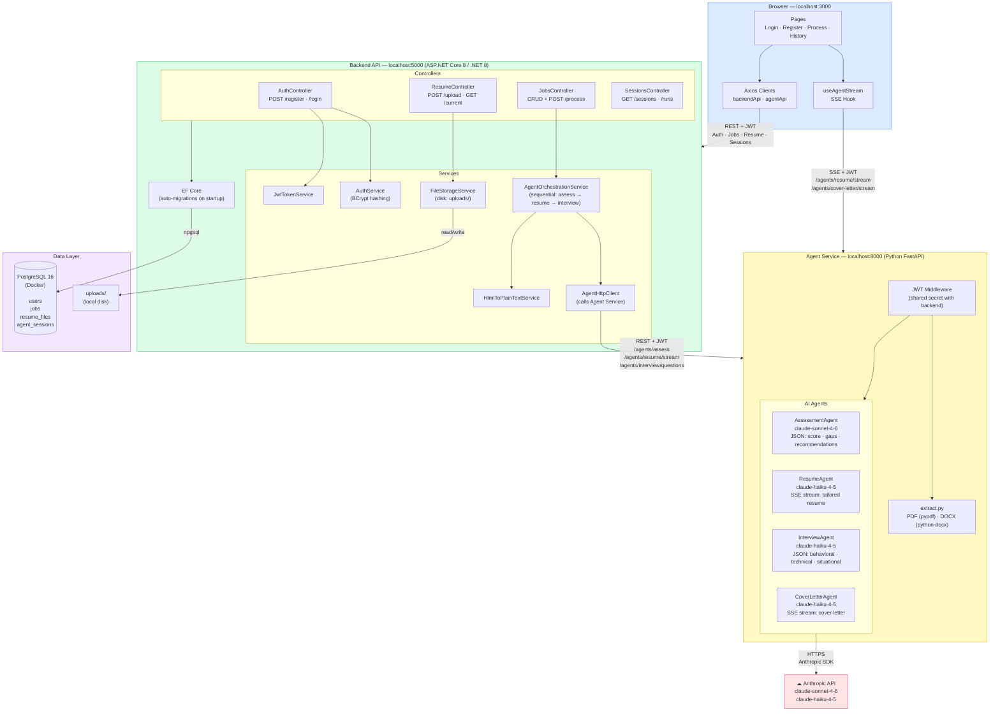
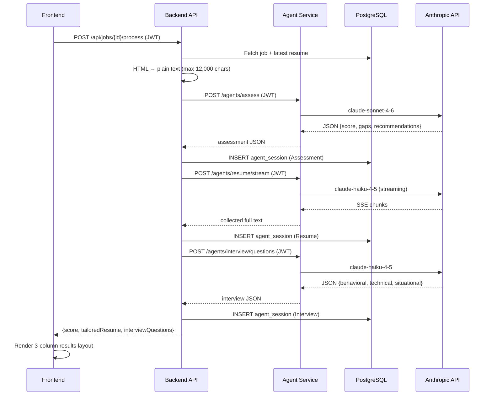

# mi-career-acer — Architecture Diagram

## System Overview

## Data Flow: "Process Job" (Happy Path)

## Technology Stack Summary

| Layer | Technology | Port |
|---|---|---|
| Frontend | React 18 + TypeScript + Vite + Tailwind CSS + TipTap | 3000 |
| Backend API | ASP.NET Core 8, EF Core, JWT, AutoMapper, BCrypt | 5000 |
| Agent Service | Python 3.11, FastAPI, Uvicorn, Anthropic SDK | 8000 |
| Database | PostgreSQL 16 (Docker) | 5432 |
| AI Models | claude-sonnet-4-6 (assess), claude-haiku-4-5 (resume/interview/cover) | — |

## Key Design Decisions

- **Shared JWT secret** — backend and agent service share the same secret so the frontend's token works with both services
- **Sequential orchestration** — assess → resume → interview run one at a time (not parallel) to ensure each agent can use prior context
- **Context capping** — job descriptions and resume text are truncated to 12,000 chars before sending to Anthropic (cost control)
- **SSE for long outputs** — resume and cover letter use Server-Sent Events so the user sees text appear progressively
- **Regex JSON extraction** — agents instruct the model to output JSON only; responses are parsed with regex to strip any prose wrapper
